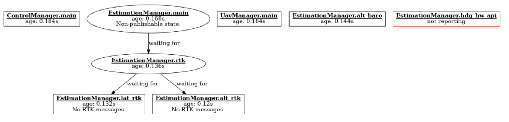

# mrs_errorgraph_viewer
 
### Installing dependencies

```bash
sudo apt install libgraphviz-dev
```
 
### How to run

```bash
roslaunch mrs_errorgraph_viewer errorgraph_viewer.launch
```

Note: MRS system needs to have errorgraph component integrated. 

#### Visualization example


